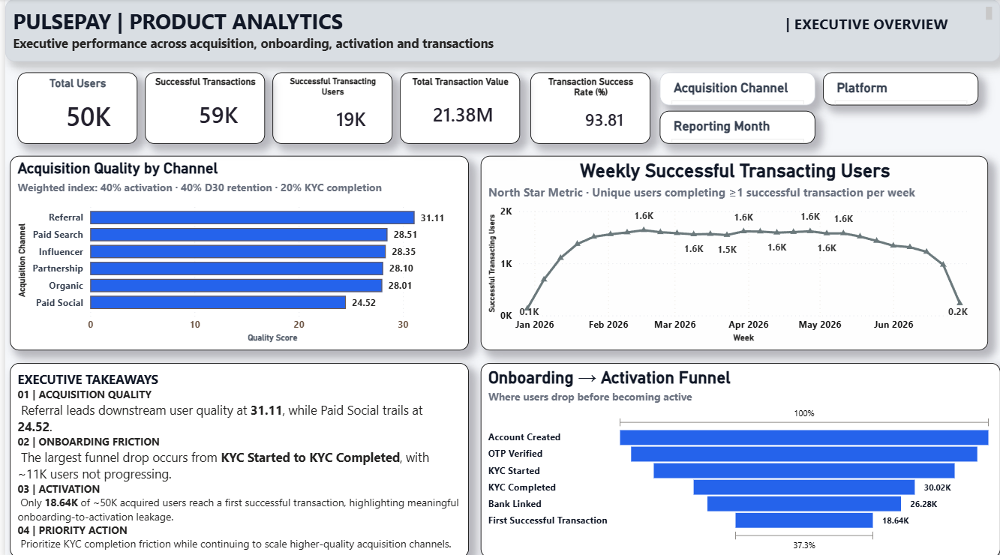
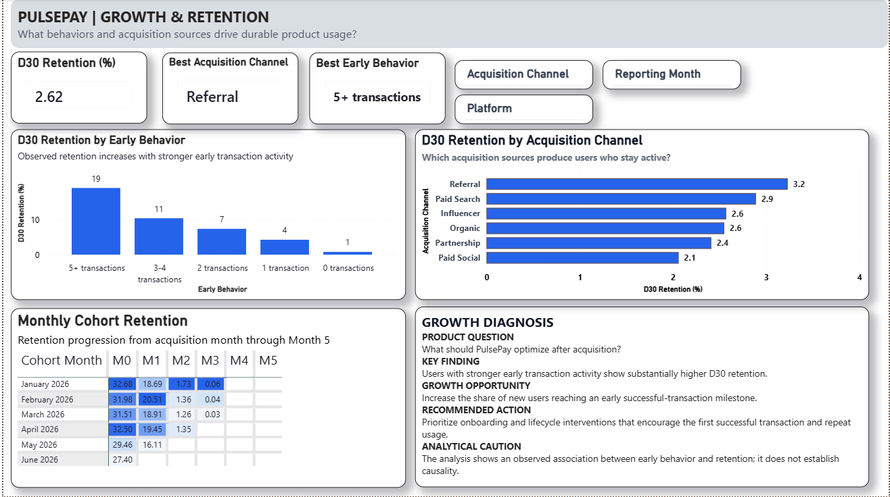
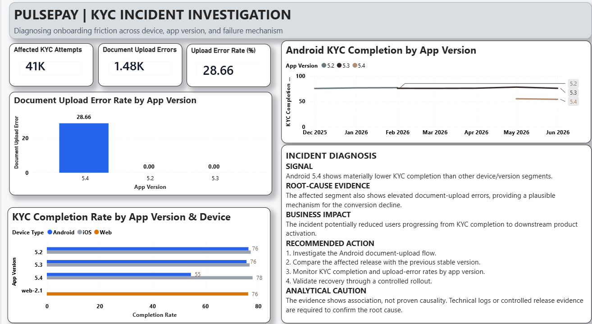
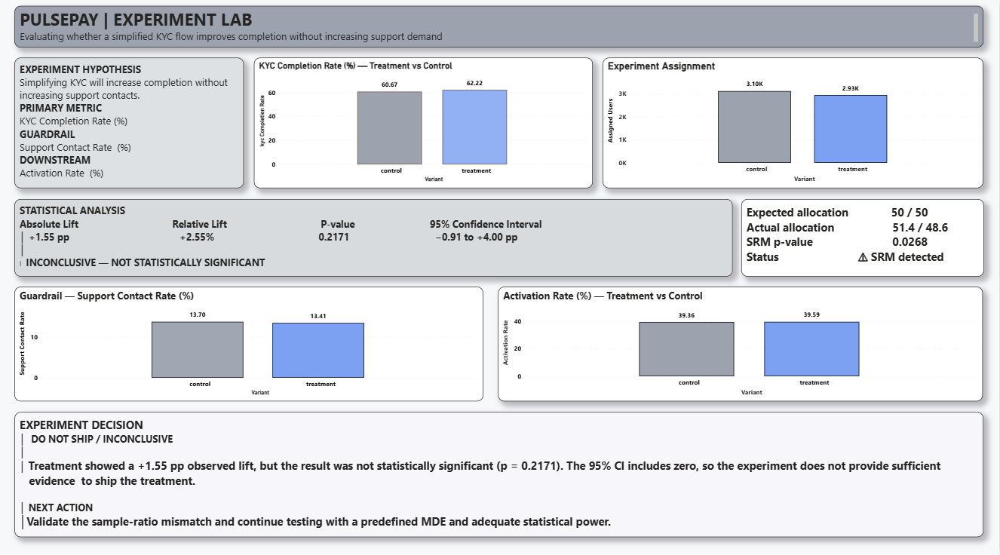

# PulsePay — End-to-End Product Analytics Case Study

> A real-world product analytics portfolio project investigating user activation, retention, acquisition quality, a KYC conversion incident, and an A/B experiment for a fictional fintech payments product.

---

## Project Overview

PulsePay is a fictional digital payments product used to simulate the type of analytical problems faced by Product Analysts in consumer fintech.

The project analyzes the complete user journey:

**Acquisition → Signup → KYC → Activation → Transaction → Retention**

The objective was not simply to build a dashboard. The project was designed to demonstrate an end-to-end product analytics workflow:

1. Define product and business questions.
2. Generate a realistic synthetic product dataset.
3. Model the data in MySQL.
4. Analyze product health and user behavior with SQL.
5. Diagnose a product conversion incident.
6. Evaluate acquisition quality.
7. Perform cohort and retention analysis.
8. Analyze an A/B experiment using statistical testing in Python.
9. Build a decision-oriented Power BI dashboard.
10. Translate analytical findings into product recommendations.

---

## Business Context

PulsePay's product team wants to understand three major areas:

### 1. Activation and Retention

Where do users drop out of the onboarding journey, and which early behaviors are associated with stronger long-term retention?

### 2. KYC Conversion Incident

Why did KYC completion deteriorate for a segment of users, and what was the potential downstream business impact?

### 3. Product Experimentation

Did a simplified KYC experience improve completion without negatively affecting support contacts or downstream activation?

---

## Key Findings

### 1. A major KYC performance gap was isolated to Android 5.4

The investigation identified Android app version `5.4` as a materially underperforming segment.

| Metric | Result |
|---|---:|
| KYC attempts | 5,150 |
| Actual KYC completions | 2,810 |
| Document upload errors | 1,476 |
| Actual KYC completion rate | 54.56% |
| Android 5.3 reference completion rate | 75.60% |
| Completion-rate gap | -21.04 percentage points |

The affected version also recorded elevated document-upload errors, providing a plausible failure mechanism for the conversion decline.

**Product recommendation:** prioritize investigation of the Android document-upload flow, compare the affected release with the previous stable version, and introduce version-level monitoring for KYC completion and upload failures.

---

### 2. The incident may have had meaningful downstream impact

Using Android `5.3` as a counterfactual reference baseline:

- Expected KYC completions at baseline performance: **3,894**
- Actual KYC completions: **2,810**
- Estimated additional KYC completions at baseline performance: **1,084**
- Observed post-KYC activation rate: **57.62%**
- Estimated additional activated users at baseline performance: **624**

These figures are counterfactual estimates rather than proven causal impact.

The analysis suggests that product-quality issues during onboarding can propagate beyond the immediate funnel step and affect downstream activation.

---

### 3. Early product behavior is associated with stronger retention

Users were segmented according to the number of successful transactions completed during their first seven days.

The analysis evaluates whether users who establish repeated product usage early in their lifecycle demonstrate stronger D30 retention.

This provides a behavioral framework for activation:

> Activation should represent meaningful early product value, not merely account creation.

Because this analysis is observational, the relationship should not be interpreted as proof that increasing early transaction count will automatically cause higher retention.

---

### 4. Acquisition volume and acquisition quality are different

Acquisition channels were evaluated using downstream product outcomes rather than sign-up volume alone.

The analysis compared:

- KYC completion
- Activation
- D30 retention
- Acquisition volume

A weighted quality index was also created:

- 40% Activation
- 40% D30 Retention
- 20% KYC Completion

The score is a prioritization framework rather than a universal metric.

**Product implication:** marketing investment should consider downstream user quality instead of optimizing only for top-of-funnel acquisition volume.

---

### 5. The KYC experiment did not establish a winner

The experiment included **6,032 users**.

| Metric | Control | Treatment |
|---|---:|---:|
| Assigned users | 3,102 | 2,930 |
| KYC completion rate | 60.67% | 62.22% |
| Support contact rate | 13.70% | 13.41% |
| Activation rate | 39.36% | 39.59% |

The treatment showed a directional improvement in KYC completion:

- Absolute lift: **+1.55 percentage points**
- Relative lift: **+2.55%**
- Z-score: **1.2343**
- P-value: **0.2171**
- 95% confidence interval: **[-0.91, +4.00] percentage points**

The observed difference was **not statistically significant** at the 5% significance level.

### Experiment decision

**Do not claim the treatment as a winner.**

The available evidence does not establish that the treatment improved KYC completion.

The experiment also produced a sample-ratio-mismatch warning:

- SRM p-value: **0.0268**

Before making a rollout decision, the assignment process and experiment instrumentation should be investigated.

---

## Product Analytics Framework

The project follows this analytical structure:

```text
Product Health
      ↓
Activation Funnel
      ↓
Root-Cause Investigation
      ↓
Retention & Cohorts
      ↓
Acquisition Quality
      ↓
Experimentation
      ↓
Product Decision
```

---

## Dashboard

The Power BI report is structured as a four-page product analytics command center.

### 1. Executive Overview

Focuses on:

- Product KPIs
- North Star metric
- Onboarding funnel
- Acquisition quality
- Executive product findings

### 2. Growth & Retention

Focuses on:

- Early product behavior
- D30 retention
- Monthly cohort retention
- Acquisition-channel quality

### 3. KYC Incident Investigation

Focuses on:

- KYC performance by app version
- Document-upload failures
- Weekly KYC trends
- Estimated business impact
- Product recommendations

### 4. Experiment Lab

Focuses on:

- Control vs treatment allocation
- Primary metric
- Guardrail metric
- Downstream activation
- Statistical significance
- Experiment decision

---


### 01 — Executive Overview



### 02 — Growth & Retention



### 03 — KYC Incident Investigation



### 04 — Experiment Lab



---

---

## North Star Metric

The primary product-usage metric used in the project is:

### Weekly Successful Transacting Users

A user is counted when they complete at least one successful transaction during a calendar week.

This metric was selected because it represents meaningful product usage rather than passive account ownership.

---

## Activation Framework

The project distinguishes between:

### Technical activation

The user completes a first successful transaction.

### Behavioral activation

The user establishes repeated product usage during the early lifecycle.

The analysis evaluates successful transactions during the first seven days as a potential behavioral activation signal and compares this behavior with D30 retention.

---

## Experiment Methodology

The KYC experiment was evaluated using:

- Experiment allocation validation
- Duplicate-assignment checks
- Sample-ratio-mismatch testing
- Primary metric comparison
- Absolute lift
- Relative lift
- Two-proportion z-test
- P-value
- 95% confidence interval
- Guardrail metric
- Downstream activation

A higher treatment metric was not automatically interpreted as a successful experiment.

Statistical uncertainty and experiment integrity were included in the final decision.

---

## Technology Stack

| Layer | Technology |
|---|---|
| Database | MySQL 8 |
| SQL Development | MySQL Workbench |
| Data Generation | Python |
| Data Analysis | Python, Pandas |
| Statistical Testing | Python |
| Visualization | Power BI |
| Version Control | Git |
| Repository | GitHub |

---

## Repository Structure

```text
pulsepay-product-analytics/
│
├── data/
│   ├── raw/
│   └── processed/
│       └── final_results/
│
├── dashboard/
│   └── PulsePay_Product_Analytics.pbix
│
├── docs/
      ├── case-study.md
      ├── data-dictionary.md
      ├── methodology.md
      ├── metric_dictionary.md
      └── project_charter.md 
│

├── python/
│   ├── data_generation/
│   │   ├── generate_pulsepay_data.py
│   │   └── load_data_to_mysql.py
│   │
│   └── analysis/
│       ├── experiment_analysis.py
│       └── export_final_results.py
│
├── sql/
│   ├── 01_setup/
│   ├── 02_analysis/
│   │   ├── 001_product_health.sql
│   │   ├── 002_activation_funnel.sql
│   │   ├── 003_root_cause_analysis.sql
│   │   ├── 004_retention_analysis.sql
│   │   ├── 005_cohort_analysis.sql
│   │   └── 006_acquisition_analysis.sql
│   │
│   ├── 03_experiments/
│   │   └── 001_kyc_ab_test.sql
│   │
│   └── 04_dashboard/
│       ├── 001_create_dashboard_views.sql
│       └── 002_create_incident_impact_view.sql
│
├
│
├── README.md
├── requirements.txt
└── .gitignore
```

---

## Analytical Outputs

The project includes reproducible exports for:

- Executive KPIs
- Weekly North Star metric
- Onboarding funnel
- KYC performance by device and app version
- Weekly KYC trends
- Acquisition quality
- Activation and retention
- Cohort retention
- Experiment scorecard
- KYC incident impact

These outputs are stored under:

```text
data/processed/final_results/
```

---

## Reproducibility

### 1. Create and activate a Python virtual environment

Windows:

```bash
python -m venv .venv
.venv\Scripts\activate
```

### 2. Install dependencies

```bash
pip install -r requirements.txt
```

### 3. Generate the synthetic dataset

```bash
python python/data_generation/generate_pulsepay_data.py
```

### 4. Create the MySQL schema and load the data

Run the setup SQL scripts from:

```text
sql/01_setup/
```

### 5. Run the analysis

Run the SQL files from:

```text
sql/02_analysis/
sql/03_experiments/
```

### 6. Create dashboard views

Run:

```text
sql/04_dashboard/001_create_dashboard_views.sql
sql/04_dashboard/002_create_incident_impact_view.sql
```

### 7. Run statistical experiment analysis

```bash
python python/analysis/experiment_analysis.py
```

### 8. Export final analytical results

```bash
python python/analysis/export_final_results.py
```

---

## Data Disclosure

This project uses a **synthetic dataset generated specifically for portfolio and educational purposes**.

PulsePay is a fictional product.

The project does not contain real customer, financial, KYC, or personally identifiable information.

The dataset was designed to simulate realistic product analytics patterns, including:

- Funnel drop-off
- User activation
- Retention behavior
- Acquisition-channel differences
- App-version performance differences
- KYC failure patterns
- Product experimentation

Because the data is synthetic, findings demonstrate analytical methodology and decision-making rather than real-world business performance.

---

## Analytical Limitations

### Synthetic data

The patterns originate from a simulated dataset and should not be interpreted as evidence about a real fintech product.

### Observational retention analysis

The relationship between early transaction behavior and later retention is associative and does not establish causality.

### Incident impact estimation

The Android 5.3 completion rate is used as a reference counterfactual for Android 5.4. The estimated impact assumes that the affected segment could reasonably have performed at the reference rate.

### Experiment integrity

The experiment produced a statistically significant sample-ratio-mismatch warning against the intended 50/50 allocation. Assignment and instrumentation should therefore be investigated before making a rollout decision.

---

## Product Recommendations

Based on the analysis:

1. **Investigate and remediate the Android 5.4 KYC document-upload experience.**
2. **Introduce automated KYC monitoring segmented by device and app version.**
3. **Track behavioral activation rather than relying only on account creation.**
4. **Design interventions that help new users establish meaningful early product usage.**
5. **Evaluate acquisition channels using downstream activation and retention quality.**
6. **Do not ship experiment treatments based only on directional metric movement.**
7. **Investigate the experiment allocation imbalance before drawing rollout conclusions.**
8. **Define experiment power and minimum detectable effect before future tests.**

---

## What This Project Demonstrates

This project demonstrates practical experience with:

- Product metric definition
- North Star metrics
- Funnel analysis
- Activation analysis
- Retention analysis
- Cohort analysis
- Root-cause investigation
- Product incident analysis
- Acquisition quality analysis
- A/B testing
- Statistical significance
- Confidence intervals
- Sample-ratio-mismatch checks
- SQL analytics
- Python analysis
- MySQL data modeling
- Power BI reporting
- Product recommendations
- Analytical limitations and responsible interpretation

---

## Project Status

**Core analytics:** Complete  
**Statistical experiment analysis:** Complete  
**Dashboard data layer:** Complete  
**Power BI dashboard:** Complete  
**Documentation:** Complete
## Author

**Divya Solanki**

B.Tech - Geoinformatics
Product Analytics | Data Analytics | SQL | Python | Power BI

GitHub: DivyaSolanki95
---

